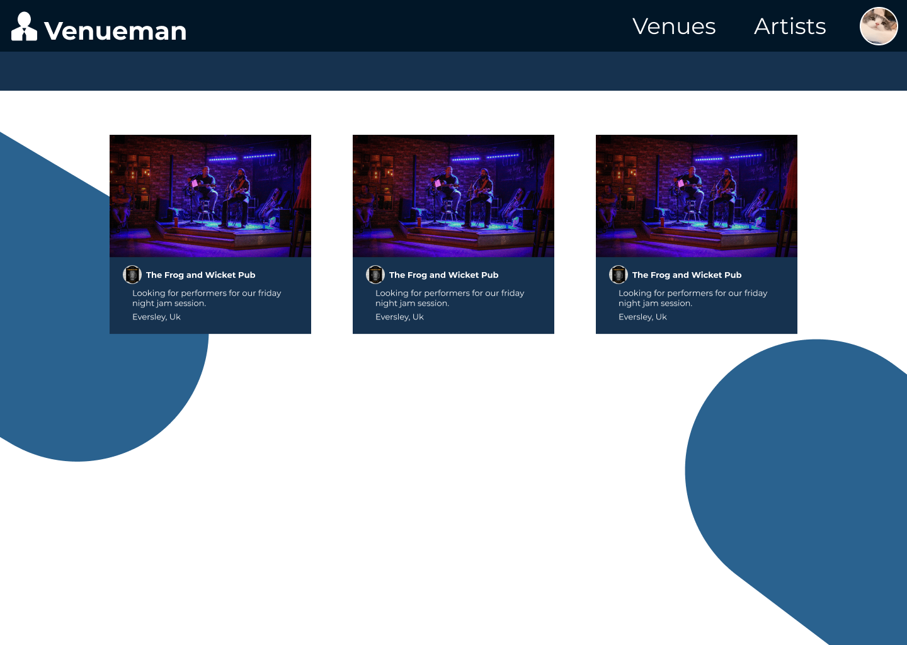
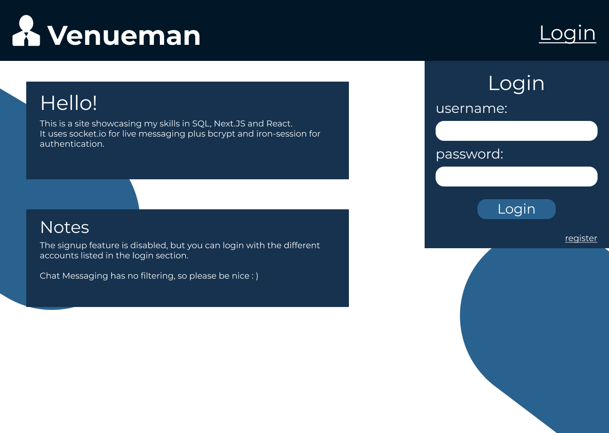
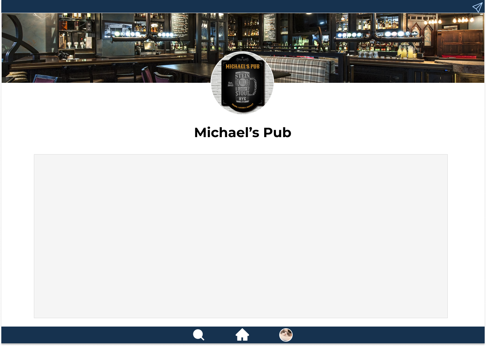

# PlayAtMyGig / VenueMan

## Description: ##
A website for small-time musicians to find venues to play in locally.
## Used: ##
NextJS + MySQL + TypeScript

Implemented a Secure, Flexible authentication system using Auth0 and MySQL
Has a separate ExpressJS server for storing and serving images such as band banners and profile pictures.
Live Messaging service using Webhooks API

## Pictures: ##

